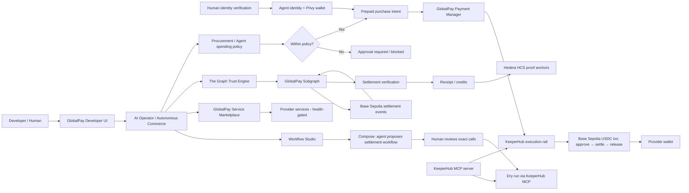

# GlobalPay Architecture

GlobalPay is an autonomous AI-commerce platform. Humans provide identity and policy; AI agents discover providers and make decisions; **KeeperHub executes USDC settlement deterministically on Base Sepolia** (MCP dry-run → execute); The Graph supplies independently indexed settlement evidence; Hedera HCS anchors tamper-evident receipts to a public ledger.

## System Diagram



## Payment Sequence

```text
1. User gives an agent a goal.
2. GlobalPay discovers active Marketplace services (dead endpoints refused at compose time).
3. The Trust Engine analyzes indexed settlement history.
4. The agent ranks providers using trust, risk, price, and capability.
5. Procurement policy checks budget, provider, trust, and execution mode.
6. A prepaid purchase intent is created — this composes the settlement workflow.
7. The human reviews the exact calls (contract, function, args) before anything runs.
8. KeeperHub dry-runs every step (wouldRevert + gas estimate) without touching chain state.
9. KeeperHub executes the reviewed workflow: approve → settle → release on the Payment
   Manager, signed by the org Turnkey wallet (nonce, gas, retries handled by KeeperHub).
10. The Graph indexes the settlement; GlobalPay verifies before declaring completion.
11. HELD / DELIVERED / RELEASED anchors are written to a public Hedera HCS topic.
12. The purchase session becomes paid/active and credits/access are recorded.
```

## Responsibility Boundaries

| Layer | Responsibility |
|---|---|
| KeeperHub MCP | Dry-run simulation, deterministic execution, gas/nonce/retry infrastructure, audit trail |
| KeeperHub Turnkey wallet | Custodial signing for settlement txs (org-level, non-custodial to end users) |
| The Graph | Indexed settlement evidence, trust, risk, and verification |
| Hedera HCS | Public, tamper-evident proof anchors verifiable from any mirror node |
| AI Operator | Natural-language intent, provider decision, workflow composition, execution trace |
| Procurement policy | Budget and approval controls before any payment |
| Workflow Studio | Human review of the exact calls; nothing executes that wasn't reviewed |
| Privy server wallets | Per-agent USDC custody and balance display |
| Payment Manager | Prepaid settlement contract path and platform/provider split (Base Sepolia) |
| Service Gateway | Provider health, access grants, invocation, and metering |

## Implementation status

### Implemented and running

- KeeperHub MCP integration: dry-run + execute on every settlement call.
- Prepaid USDC purchases settled through the Payment Manager on Base Sepolia.
- Workflow Studio: compose → review → dry run → chaos probe → execute → prove.
- Chaos probe: tampered workflows are refused in simulation (determinism holds).
- Privy-backed agent wallets with USDC balance reads.
- The Graph settlement verification feeding the Trust Engine.
- Hedera HCS proof anchoring with public mirror verification.
- Provider health gating at purchase time.

### Explicitly not claimed

- No mainnet deployment — everything runs on Base Sepolia + Hedera testnet.
- Direct agent-signed transfers are blocked by design (agent wallets hold USDC, not gas; the KeeperHub rail pays gas from the org wallet).
- Circle Gateway/CCTP bridging, paymaster gas abstraction, and StableFX are not implemented.
- The escrow helper used by some legacy flows is a platform ledger path, not an on-chain escrow contract.
