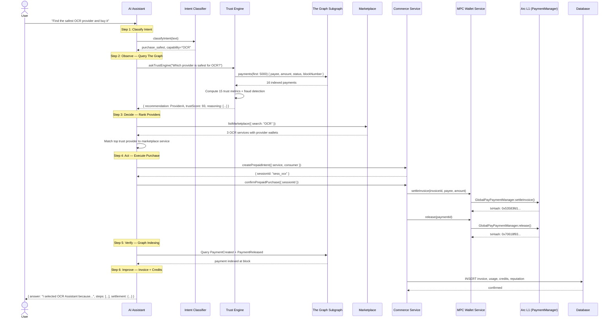

# GlobalPay AI Assistant — Architecture & Demo Guide

## Overview

The AI Assistant is the **natural-language interface** to GlobalPay. A human types one sentence, and the system autonomously executes the full **Observe → Decide → Act → Verify → Improve** loop — querying The Graph for provider intelligence, selecting the safest provider, executing an Arc USDC settlement, verifying on-chain indexing, and generating an invoice with credits.

**No LLM required.** Intent classification is deterministic regex. Provider reasoning comes entirely from The Graph subgraph. Settlement is real Arc USDC via MPC wallets.

---

## Architecture Diagram

```
┌──────────────────────────────────────────────────────────────────┐
│                    USER / EXTERNAL AI AGENT                      │
│                                                                  │
│   "Find the safest OCR provider and buy it."                     │
└──────────────────────┬───────────────────────────────────────────┘
                       │
                       ▼
┌──────────────────────────────────────────────────────────────────┐
│              AI ASSISTANT SERVICE (aiAssistantService.js)         │
│                                                                  │
│  ┌─────────────┐   ┌──────────────┐   ┌───────────────────────┐ │
│  │   Intent     │   │   Bazantic   │   │   Step Tracker        │ │
│  │ Classifier   │   │   Recipe     │   │   (observe→decide→    │ │
│  │ (14 intents) │   │   Selector   │   │    act→verify)        │ │
│  └──────┬──────┘   └──────┬───────┘   └───────────────────────┘ │
│         │                 │                                       │
│         ▼                 ▼                                       │
│  ┌──────────────────────────────────────────────────────────┐    │
│  │              ORCHESTRATION ENGINE                        │    │
│  │                                                          │    │
│  │  1. classifyIntent(text) → purchase_safest               │    │
│  │  2. extractCapability(text) → "OCR"                      │    │
│  │  3. askTrustEngine("Which provider is safest for OCR?")  │    │
│  │  4. listMarketplace({ search: "OCR" })                   │    │
│  │  5. createPrepaidIntent({ service, consumer })           │    │
│  │  6. confirmPrepaidPurchase({ sessionId })                │    │
│  │  7. verifySettlement(txHash)                             │    │
│  │  8. Return structured answer with reasoning              │    │
│  └──────────────────────────────────────────────────────────┘    │
└───────┬──────────────┬──────────────┬────────────────────────────┘
        │              │              │
        ▼              ▼              ▼
┌──────────────┐ ┌──────────┐ ┌──────────────────────────────┐
│  THE GRAPH   │ │  ARC L1  │ │  GLOBALPAY SERVICES          │
│              │ │          │ │                               │
│  Subgraph:   │ │ Contract │ │  marketplaceService           │
│  • Payments  │ │ 0x775Ab… │ │  commerceService              │
│  • Settlement│ │          │ │  graphIntelligenceService     │
│  • Invoice   │ │ MPC      │ │  agentDecisionEngine          │
│  • Providers │ │ Wallets  │ │  mpcWalletService             │
│              │ │          │ │  webhookService               │
│  Query:      │ │ USDC     │ │  auditService                 │
│  "safest"    │ │ native   │ │                               │
└──────────────┘ └──────────┘ └──────────────────────────────┘
```

---

## Sequence Diagram



---

## Supported Intents

| Intent | Example Prompt | What Happens |
|--------|---------------|--------------|
| `purchase_safest` | "Buy the safest OCR provider" | Observe→Decide→Act→Verify full loop |
| `purchase_cheapest` | "Purchase cheapest GPU provider" | Price-sorted provider selection + purchase |
| `purchase_under` | "Get OCR under 0.001 USDC" | Budget-filtered provider + purchase |
| `purchase_generic` | "Buy OCR" | Best-match provider + purchase |
| `find_safest` | "Who is the safest OCR provider?" | Trust Engine analysis, no purchase |
| `find_cheapest` | "Which provider is most affordable?" | Price ranking from marketplace |
| `find_earners` | "Who earned the most USDC?" | Volume-ranked provider list |
| `find_risky` | "Show risky providers" | Fraud detection flags from Graph |
| `find_active` | "Which provider was most recently active?" | Recency-ranked list |
| `find_success_rate` | "Providers above 95% success rate" | Threshold-filtered ranking |
| `verify_payment` | "Verify my last payment" | Graph lookup + verification |
| `show_balance` | "Show my balance" | Arc wallet balances |
| `show_reputation` | "Show reputation changes" | Trust Engine provider scores |
| `help` | "What can you do?" | Capability list |

---

## Trust Engine — How The Graph Drives Decisions

The Trust Engine queries The Graph subgraph and computes **15 metrics** per provider:

```
┌─────────────────────────────────────────────────────────────┐
│                    TRUST ENGINE INPUTS                       │
│                                                              │
│  From The Graph Subgraph:                                    │
│  ├── paymentCount (total indexed payments)                   │
│  ├── successfulPayments (status=RELEASED)                    │
│  ├── failedPayments (status=FAILED/CANCELLED)                │
│  ├── settlementVolume (sum of amounts in USDC)               │
│  ├── uniquePayers (distinct payer addresses)                 │
│  ├── repeatBuyers (payers with >1 payment)                   │
│  ├── lastSettlementBlock (most recent block)                 │
│  ├── paymentsLast24h, paymentsLast7d, paymentsLast30d        │
│  ├── avgPaymentValue, medianPaymentValue                     │
│  ├── timeBetweenPayments (avg interval)                      │
│  └── activityTrend (accelerating/steady/slowing/dormant)     │
│                                                              │
│  Fraud Signals:                                              │
│  ├── selfPayments (payer == payee)                           │
│  ├── cancellationStreak (>3 consecutive)                     │
│  ├── volumeSpike (>5x baseline)                              │
│  └── failureDominant (>50% failed)                           │
└─────────────────────────────────────────────────────────────┘
                           │
                           ▼
┌─────────────────────────────────────────────────────────────┐
│                    TRUST SCORE (0-100)                       │
│                                                              │
│  40% × successRate                                           │
│  + 15% × customerDiversity (unique buyers / max seen)        │
│  + 15% × trackRecord (payments / 10, capped at 1.0)          │
│  + 15% × recency (1.0 if <7d, else decay)                   │
│  + 15% × consistency (median stability ratio)                │
│  − fraudPenalties (self_payment: -20, volume_spike: -15,     │
│    failure_dominant: -25, cancellation_streak: -10)          │
│                                                              │
│  Confidence = min(1.0, paymentCount / 20)                    │
│  Risk Level = HIGH (<40) | MEDIUM (40-69) | LOW (≥70)        │
└─────────────────────────────────────────────────────────────┘
                           │
                           ▼
┌─────────────────────────────────────────────────────────────┐
│               EVIDENCE-BACKED REASONING                      │
│                                                              │
│  "I selected OCR Assistant because The Graph shows:"         │
│  • 14 successful settlements of 14 indexed payments          │
│  • 100.0% success rate                                       │
│  • 0.0014 USDC total settlement volume                       │
│  • 13 unique buyer(s), 1 repeat buyer(s)                     │
│  • Last settlement 2h ago; 14 payment(s) in last 7 days      │
│  • Activity trend: accelerating                              │
│  • Risk: LOW · Confidence: 70%                               │
└─────────────────────────────────────────────────────────────┘
```

---

## API Endpoints

### POST /api/developers/ai-assistant/chat

**Request:**
```json
{
  "message": "Find the safest OCR provider and buy it",
  "consumerAgentId": "agt_xxx"
}
```

**Response (purchase):**
```json
{
  "success": true,
  "message": "Completed: purchased OCR Assistant for 0.001 USDC.",
  "answer": "I selected OCR Assistant because The Graph shows:\n• 14 successful settlements of 14 indexed payments\n• 100.0% success rate\n• 13 unique buyer(s)\n• Last settlement 2h ago\n\nRisk: LOW · Confidence: 70%\n\nThe payment has been settled on Arc.\nTransaction: 0x53583fd1...\nInvoice: INV-xxx\nCredits granted: 1",
  "steps": [
    { "phase": "observe", "label": "Querying The Graph", "status": "complete" },
    { "phase": "decide", "label": "Ranking providers", "status": "complete" },
    { "phase": "act", "label": "Settling on Arc", "status": "complete" },
    { "phase": "verify", "label": "Verifying on The Graph", "status": "complete" }
  ],
  "data": {
    "provider": { "trustScore": 93, "riskLevel": "LOW", "reasoning": ["..."] },
    "service": { "title": "OCR Assistant", "price": 0.001 },
    "settlement": { "txHash": "0x53583fd1...", "explorerUrl": "https://sepolia.basescan.org/tx/0x53583fd1..." },
    "verification": { "verified": true, "block": 60774609 },
    "invoice": { "invoiceId": "INV-xxx" },
    "credits": 1
  }
}
```

**Response (query):**
```json
{
  "success": true,
  "message": "Provider analysis from The Graph...",
  "answer": "🔍 Provider Trust Analysis\n\n#1 OCR Assistant — Trust 93/100 · LOW risk\n  • 14 successful settlements\n  • 100.0% success rate\n  • 13 unique buyers\n  • Activity: accelerating\n...",
  "steps": [
    { "phase": "observe", "label": "Querying The Graph", "status": "complete" },
    { "phase": "decide", "label": "Analyzing results", "status": "complete" }
  ],
  "data": {
    "providers": [...],
    "recommendation": { "providerId": "0x...", "trustScore": 93 }
  }
}
```

---

## 2-Minute Hackathon Demo Flow

### Setup (30 seconds)

1. Open the Developer Console at `http://localhost:5173`
2. Navigate to **AI Assistant** in the sidebar
3. Show the suggested prompts

### Demo 1: Provider Discovery (30 seconds)

**Type:** "Who is the most trusted AI provider?"

**Show:**
- The Graph loading (observe phase)
- Trust Engine computing 15 metrics
- Ranked providers with trust scores
- Evidence-backed reasoning

**Say:** "Every ranking comes from The Graph subgraph — real on-chain settlement history, not database reputation."

### Demo 2: Full Purchase (60 seconds)

**Type:** "Find the safest OCR provider and buy it"

**Show the step-by-step execution:**
1. **Observe** — The Graph query runs, 15 metrics computed
2. **Decide** — Provider selected with confidence score
3. **Act** — MPC wallet signs settlement, Arc transaction confirmed
4. **Verify** — Graph indexing confirmed, invoice generated

**Show the cards:**
- Base Transaction Card with TX hash + Basescan link
- Graph Evidence Card with block number + entity ID
- Invoice Card with invoice ID + credits

**Say:** "The entire flow — from 'I need OCR' to USDC settled on Arc — happened autonomously. Every decision was backed by The Graph."

### Demo 3: Fraud Detection (30 seconds)

**Type:** "Show risky providers"

**Show:**
- Self-payment detection (payer == payee)
- Cancellation streak flags
- Volume spike warnings
- Risk level badges

**Say:** "The Trust Engine automatically detects wash trading and suspicious patterns from Graph data."

### Demo 4: Natural Language Queries (30 seconds)

Try these rapid-fire:
- "Which provider earned the most USDC?"
- "Show providers above 95% success rate"
- "Verify my last payment"
- "Show my balance"

**Say:** "The assistant understands natural language — no API calls, no code, just plain English."

---

## Key Talking Points for Judges

1. **The Graph is the decision engine, not a reputation calculator.** Every provider selection, trust score, and fraud detection comes from The Graph subgraph — real on-chain settlement history.

2. **The AI reasons from blockchain data.** Instead of returning "Provider A: 72/100", it explains: "I selected Provider A because The Graph shows 14 successful settlements across 13 unique buyers with 100% success rate."

3. **Settlement is real.** Every purchase executes real txs on Base Sepolia through KeeperHub (dry-run → execute). The TX hash is verifiable on Basescan, and receipts are anchored to a public Hedera HCS topic.

4. **The full loop is autonomous.** From natural-language request to invoice generation — no manual intervention, no mock data, no PostgreSQL fallback.

5. **Bazantic recipes enable external AI agents.** The `demo-agent.mjs` script proves another AI can consume the recipes and execute the same flow.

---

## Files

| File | Purpose |
|------|---------|
| `backend/src/services/aiAssistantService.js` | NL intent classifier + recipe orchestrator |
| `backend/src/controllers/aiAssistantController.js` | Express controller |
| `backend/src/routes/developer.js` | Route wiring (POST /ai-assistant/chat) |
| `client/src/pages/developer/DevAiAssistant.jsx` | Chat UI with reasoning cards |
| `bazantic-recipes/ai-assistant.json` | Bazantic recipe for the assistant |
| `scripts/bazantic-agent-demo.mjs` | External agent demo script |
| `docs/AI_ASSISTANT.md` | This document |
